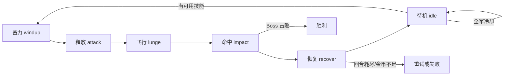

# AI Maze — Web 前端

> 纯静态前端 · HTML5 + CSS3 + Vanilla JavaScript · 无需后端

本项目包含两套独立的 Web 前端页面，直接在浏览器中打开即可运行。

---

## 1. 迷宫探险 (`index.html`)

迷宫探索全流程可视化，用于观察 AI 在战争迷雾（FOG）下的决策轨迹。

### 功能概览

| 模块 | 说明 |
|------|------|
| **开始界面** | 赛博朋克风格全屏入场动画（网格线 + 扫描线特效），展示地图尺寸、规划路径、Boss 数量等概览信息；支持直接导入 JSON 地图文件 |
| **Canvas 画布** | 960×960 高清迷宫渲染，支持精灵贴图模式与色块模式自由切换，悬停查看格子详情 |
| **播放控制** | 播放/暂停、上一帧/下一帧、重置、进度条拖拽、1×~12× 变速播放 |
| **视图模式** | 四种视角切换——**实况**（玩家 3×3 FOV 迷雾）、**全图**（上帝视角无迷雾）、**风险**（陷阱热度分布）、**收益**（金币价值分布） |
| **显示开关** | 迷雾、路径轨迹、热力图、精灵贴图 四项独立 Toggle |
| **运行指标** | 实时显示当前回合数、金币余额、地图探索率、路径长度 |
| **状态详情** | 右侧面板：悬停格子坐标/类型/权重、图例、事件流时间线 |
| **Boss 战弹窗** | 遭遇 Boss 时弹出全屏覆盖层，通过 iframe 嵌入 `boss.html` 进行独立 Boss 战斗 |
| **算法对比** | 一键运行 **3×3 局部贪心** vs **记忆增强全局贪心** 双算法对比，展示总分/总步数差异 |
| **地图管理** | 内置默认 15×15 地图，支持从本地导入任意 JSON 地图文件 |

### 视图模式详解

| 模式 | 说明 |
|------|------|
| **实况** | 仅显示玩家已探索区域（3×3 视野），未探索区域以深色覆盖——模拟真实 AI 感知范围 |
| **全图** | 显示完整地图，等同于上帝视角 |
| **风险** | 以热力色标标注陷阱格子，颜色越深代表风险越高 |
| **收益** | 以热力色标标注金币格子，颜色越亮代表收益越高 |

---

## 2. Boss 战斗 (`boss.html`)

独立的 Boss 战斗可视化系统，聚焦技能循环、伤害命中与失败重试机制。

### 功能概览

| 模块 | 说明 |
|------|------|
| **开始界面** | 暗色主题入场动画（玩家 vs Boss 对峙场景），展示 Boss 数量、技能数、回合上限等战斗概览，底部预览玩家技能列表 |
| **Canvas 画布** | 1280×720 横向画布，玩家角色与 Boss 对峙场景，支持技能飞弹动画、命中闪烁（白色高亮）、屏幕震动 |
| **战斗阶段** | 六阶段动画时间线——**蓄力 (windup)** → **释放 (attack)** → **飞行 (lunge)** → **命中 (impact)** → **恢复 (recover)** → **待机 (idle)** |
| **播放控制** | 播放/暂停、逐帧步进、重置、进度条拖拽、变速播放 |
| **视图模式** | 四种视角——**实况**（动态战斗过程）、**伤害**（伤害数值高亮）、**冷却**（技能冷却状态可视化）、**结算**（Boss 击败/失败结果展示） |
| **显示开关** | 轨迹拖尾、辉光特效、精灵贴图、脉冲动效 四项独立 Toggle |
| **战斗指标** | 当前 Boss 序号（如 1/3）、尝试次数、总回合数、金币余额 |
| **技能状态** | 实时显示每个技能的伤害值、冷却回合、剩余冷却，可用技能高亮，冷却中技能灰色 |
| **事件流** | 右侧时间线记录每步战斗事件：技能蓄力 → 释放 → 命中伤害 → 重试 → 失败 |
| **参数调节** | 可自定义初始金币数，点击"重新模拟"按新参数重新生成战斗帧序列 |
| **嵌入模式** | 支持 `?embed=1` URL 参数以 iframe 嵌入模式运行；通过 `postMessage` 与父页面通信——发送 `maze-boss-ready`（就绪）和 `maze-boss-complete`（战斗结果）消息 |
| **地图管理** | 内置默认 Boss 配置（血量、技能、回合上限），支持导入 JSON 地图 |

### 战斗阶段时间线



---

## 技术栈

| 技术 | 说明 |
|------|------|
| **HTML5 / CSS3** | 语义化标签、CSS Grid/Flexbox 布局、CSS 动画与过渡 |
| **Vanilla JavaScript (ES6+)** | 零依赖，纯原生 JS 实现所有逻辑 |
| **Canvas 2D API** | 所有渲染基于 `<canvas>`，无第三方图形库 |
| **精灵图动画** | PNG 精灵表 + requestAnimationFrame 帧动画（Boss 进入/胜利/失败特效） |
| **A\* 寻路** | 前端内置 A\* 算法 JS 实现，用于路线规划展示 |
| **战争迷雾模拟** | 前端完整模拟 3×3 视野揭露与陷阱踩踏后隐藏动画 |
| **跨页面通信** | `window.postMessage` API 实现迷宫面板 ↔ Boss 面板双向通信 |

---

## 目录结构

```
web/
├── index.html          # 迷宫探险主页面
├── app.js              # 迷宫探险核心逻辑（~2000 行）
├── styles.css          # 全局样式（~800 行）
├── boss.html           # Boss 战斗主页面
├── boss.js             # Boss 战斗核心逻辑（~600 行）
├── boss.css            # Boss 战斗专属样式（~400 行）
└── assets/
    └── boss.png        # Boss 角色精灵图
```

---

## 资源依赖

页面渲染依赖以下外部图片资源（位于 `../viz/assets/` 目录）：

| 资源 | 相对路径 |
|------|----------|
| 玩家角色 | `../viz/assets/player.png` |
| Boss 角色 | `../viz/assets/boss.png` |
| 金币 | `../viz/assets/coin.png` |
| 陷阱 | `../viz/assets/trap.png` |
| 出口 | `../viz/assets/exit.png` |
| 地板 | `../viz/assets/floor.png` |
| 墙壁 | `../viz/assets/wall.png` |
| Boss 进入特效 | `../viz/assets/effects/boss_enter_effect_sheet.png` |
| Boss 胜利特效 | `../viz/assets/effects/boss_win_effect_sheet.png` |
| Boss 失败特效 | `../viz/assets/effects/boss_lose_effect_sheet.png` |
| 传送门特效 | `../viz/assets/effects/portal_enter_effect_sheet.png` |

---

## 使用方式

```bash
# 方式一：直接在浏览器中打开
# 双击 web/index.html 或 web/boss.html 即可

# 方式二：通过本地服务器（解决跨域资源加载）
cd web
python -m http.server 8080
# 访问 http://localhost:8080/index.html
```

> **注意**：直接用 `file://` 协议打开时，部分浏览器的安全策略可能阻止加载外部 JSON/图片资源。建议使用本地 HTTP 服务器。
