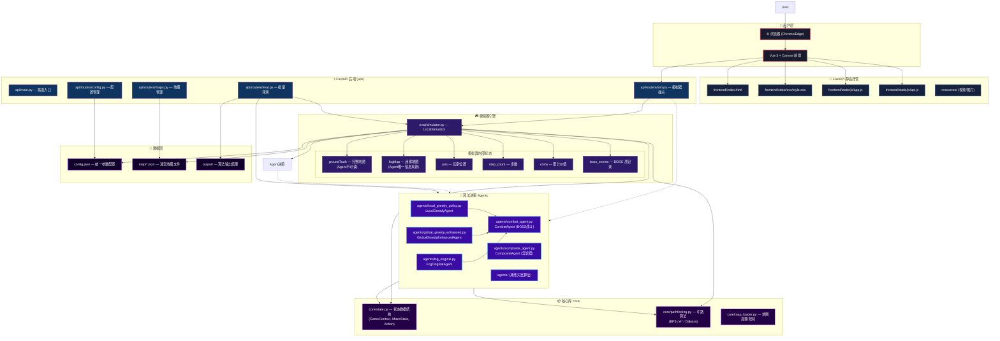

# AI Maze 项目框架图 — 生成提示词

> 以下内容可直接复制到 AI 绘图工具（如 draw.io、Excalidraw、Mermaid Live Editor）或交给 AI 图片生成模型使用。

---

## 一、Mermaid 框架图（建议用 Mermaid Live Editor 渲染）



---

## 二、数据流说明（配合框架图理解）

### 2.1 启动流程

```
用户打开浏览器 → http://127.0.0.1:8000/
    │
    ▼
FastAPI 返回 frontend/index.html
    │
    ▼
Vue 3 CDN 加载 → api.js 初始化 → 请求 /api/maps
    │
    ▼
地图列表加载 → 用户选择地图 → 算法下拉框选择 → 点击"计算"
    │
    ▼
POST /api/sim/start-run { map, agent, config }
    │
    ▼
LocalSimulator 初始化 → 加载地图JSON → 创建 GameContext
    ↓
Agent被创建 → on_episode_start(ctx)
    ↓
Simulator.run() 循环:
    agent.decide(ctx) → Action → _step(Action) → 更新ctx → 重复
    │
    ▼
返回 finalState → 前端渲染 Canvas 回放
```

### 2.2 单步 Agent 决策流程

```
agent.decide(ctx)
    │
    ├── (1) 读取 ctx.maze.fogMap ← 仅此信息来源
    │
    ├── (2) 五优先级决策:
    │     P1: 出口可见 + BOSS已死 → Dijkstra直冲出口
    │     P2: BOSS可见 → 找最近 BOSS
    │     P3: 金币可见 → 边际收益过滤 + 死胡同惩罚
    │     P4: 前沿存在 → 前沿评分 + 回访抑制
    │     P5: 无任何目标 → 最少访问邻居兜底
    │
    ├── (3) 返回 Action(move="UP"/"DOWN"/"LEFT"/"RIGHT"/"STAY")
    │
    ▼
Simulator._step(Action):
    ├── 移动玩家位置 (碰墙则拒绝)
    ├── 处理当前格效果 (金币/陷阱/BOSS/出口)
    ├── 更新 step_count
    ├── 揭露当前位置 3×3 → fogMap 扩展
    └── history.append(snapshot)
```

### 2.3 BOSS 战斗子流程

```
玩家走到 B 格 → simulator 检测到 CELL_BOSS
    │
    ▼
runBossBattle(bossHpList, skills, minRounds, coinConsumption, coins)
    │
    └── for each boss HP:
          while bossHp > 0:
            for round = 1 to minRounds:
              贪心选最高伤害可用技能
              更新冷却
            if 未击败: 扣复活费 → 冷却重置 → 重试
          → 下一个 Boss
    │
    ▼
return { won: true/false, coinsAfter, bossEvents }
```

---

## 三、分模块详细说明（供参考图用）

### 3.1 前端模块

| 组件 | 作用 |
|------|------|
| `index.html` | Vue 3 挂载点 + 骨架 |
| `style.css` | 深空霓虹主题，~900 行 |
| `app.js` | Vue 3 主逻辑：Canvas 绘制/播放控制/API 调用/~450 行 |
| `api.js` | 封装 10 个 API 端点 |

### 3.2 后端模块

| 接口 | 作用 |
|------|------|
| `GET /api/maps` | 列出可用地图 |
| `POST /api/maps/upload` | 上传自定义地图 |
| `POST /api/sim/start-run` | 创建会话 → 运行 → 返回结果 |
| `POST /api/sim/{sid}/step` | 单步步进 |
| `POST /api/sim/{sid}/run` | 继续运行已暂停的会话 |
| `DELETE /api/sim/{sid}` | 销毁会话 |
| `POST /api/eval/run` | 批量评测 |
| `GET|PUT /api/config` | 配置读写 |

### 3.3 Agent 算法模块

| Agent | 文件 | 类型 |
|-------|------|------|
| `LocalGreedyAgent` | `agents/local_greedy_policy.py` | 核心（默认） |
| `FogOriginalAgent` | `agents/fog_original.py` | 迷雾 A* + 边际过滤 |
| `GlobalGreedyEnhancedAgent` | `agents/global_greedy_enhanced.py` | 全局贪心 + 5 项增强 |
| `CombatAgent` | `agents/combat_agent.py` | BOSS 战斗决策 |
| `CompositeAgent` | `agents/composite_agent.py` | Agent 混合调度器 |

### 3.4 核心库模块

| 文件 | 关键类/函数 |
|------|------------|
| `core/state.py` | `GameContext`、`MazeState`、`PlayerState`、`Action`、`WALKABLE_CELLS`、`COIN_CELLS` |
| `core/pathfinding.py` | `bfs()`、`astar()`、`dijkstra()`、`reconstruct_path()`、`extract_path()`、`neighbors()` |
| `core/map_loader.py` | `load_json()`、`find_cell()`、`validate_map_data()` |

---

## 四、视觉风格建议（适用于绘图工具）

| 层级 | 推荐颜色 | 形状 | 说明 |
|------|---------|------|------|
| 用户层 | 深蓝底 + 红边框 | 圆角矩形 | 浏览器 / 用户交互 |
| 前端静态 | 深蓝底 + 浅蓝边框 | 矩形 | Vue 3 文件 |
| API 层 | 中蓝底 + 紫边框 | 文件形 | FastAPI 路由 |
| 模拟器 | 紫黑底 + 紫边框 | 六边形或圆角 | 游戏引擎 |
| 算法层 | 深紫底 + 蓝边框 | 圆角矩形 | 各 Agent 类 |
| 核心库 | 深紫底 + 浅紫边框 | 直角矩形 | 数据结构和寻路 |
| 数据层 | 极深紫底 + 中紫边框 | 圆柱或圆角 | JSON 文件 |

连线样式：实线 = 直接调用，虚线 = 通过 API 调用，加粗 = 核心数据流
